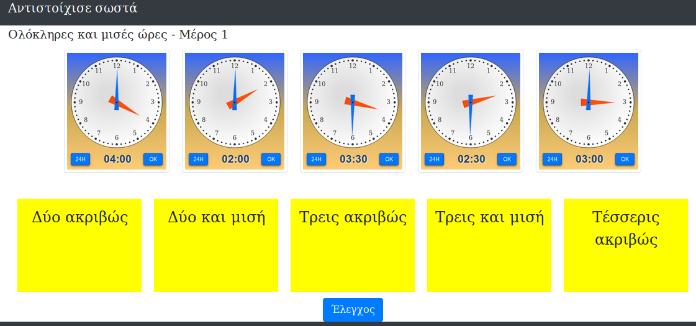
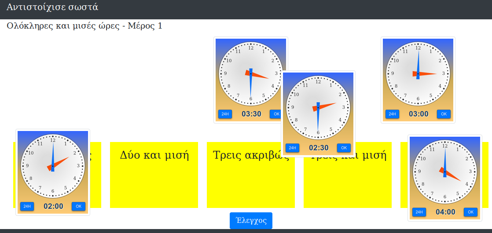

# matching_engine
Μια εφαρμογή που επιτρέπει τη δημιουργία ασκήσεων αντιστοίχισης.

Στην πάνω σειρά υπάρχουν μια σειρά από εικόνες που μπορούν να μετακινηθούν με το ποντίκι (draggable) και στην κάτω σειρά υπάρχουν μια σειρά από κίτρινα ορθογώνια μέσα στα οποία υπάρχει μια λεκτική περιγραφή (droppable). Οι μαθητές καλόύνται να κάνουν τις σωστές αντιστοιχίσεις (εικόνες με τις περιγραφές τους).

Η εφαρμογή είναι γραμμένη σε javascript, μπορεί να εγκατασταθεί σε ένα server ή και ακόμη τοπικά σε έναν υπολογιστή.

**Προσοχή**: Δεν περιλαμβάνει τα παρακάτω dependencies.

# Dependencies
bootstrap4
jquery
jquer-ui
Προτείνεται η εγκατάσταση μέσω [bower.io](https://bower.io/) 

# Screenshots

**